# 律π -- 知识管理系统
一个基于Spring Boot + React的前后端分离 知识管理平台，具备（针对已OCR的）PDF文件/图书管理与全文检索功能，并融合AI大模型。

## 目录
- [功能特性](#功能特性)
- [技术栈](#技术栈)
- [环境要求](#环境要求)
- [部署指南](#部署指南)
  - [Docker部署](#docker部署推荐)
  - [手动部署](#手动部署)
- [开发指南](#开发指南)
- [项目结构](#项目结构)
- [标签设计](#关于标签设计)
- [使用声明](#软件使用声明)
- [许可证](#开源许可与商用授权声明)

## 功能特性

- [x] 支持多用户
- [x] 自定义标签体系
- [x] PDF文件/图书管理
- [x] PDF文件全文检索
- [x] PDF文件关键词高亮显示
- [x] 接入AI大模型对话-DeepSeek
- [ ] 笔记管理，包括笔记导出
- [ ] 结合AI大模型，实现检索报告的自动生成

## demo截图
1.  登录界面
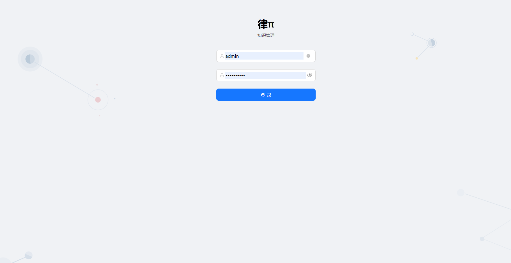

2. 欢迎界面
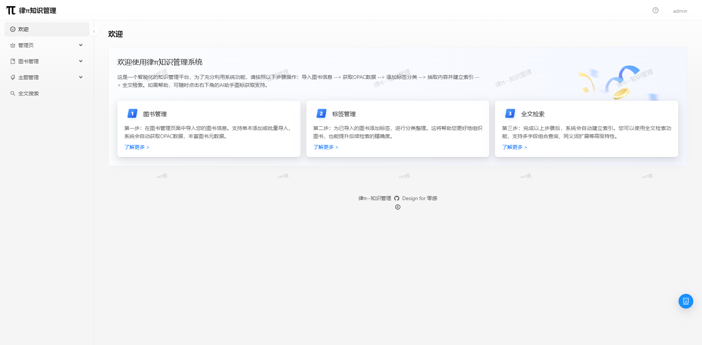

3. 用户管理界面
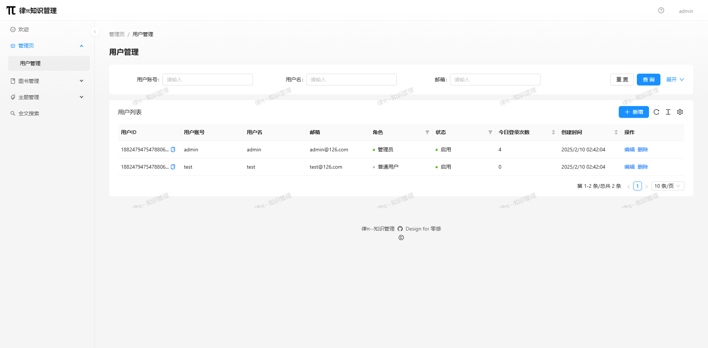
> 注意：用户管理界面需要管理员权限

4. 图书管理
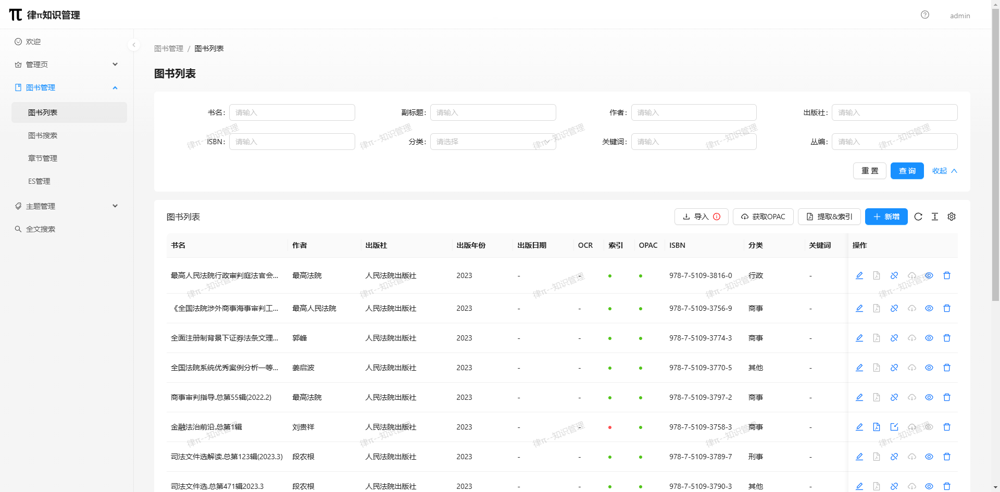

5. 图书检索
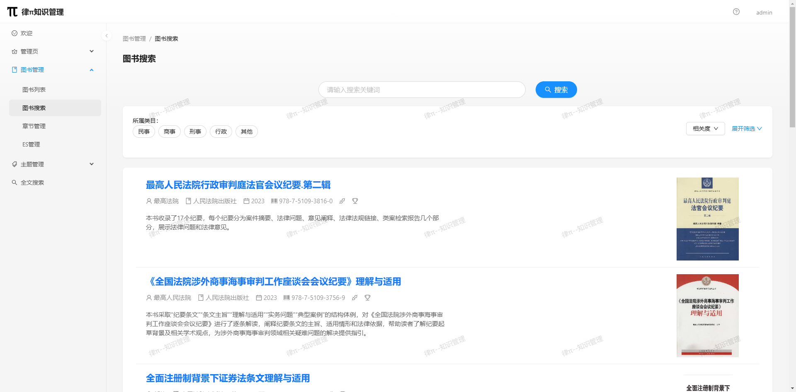

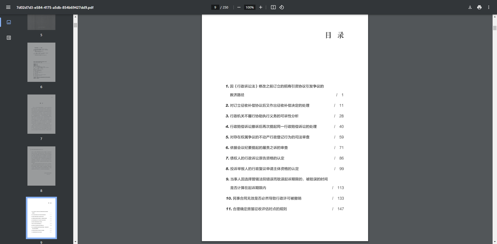

6. 全文检索
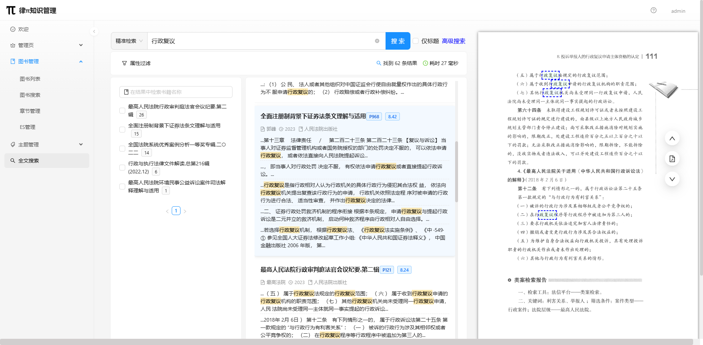


7. 主题列表--带层级关系标签
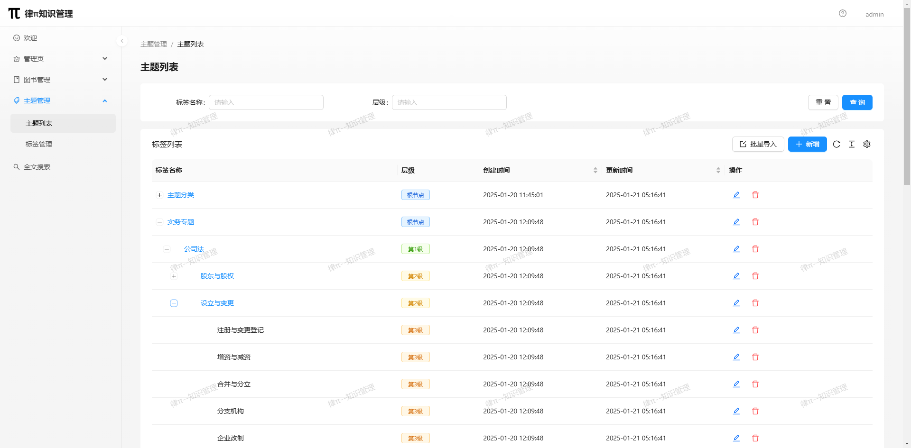

8. 自定义标签--不带层级关系标签
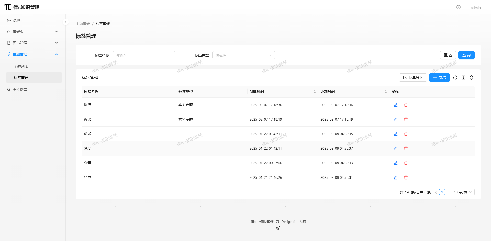


9. 全文检索

> 检索结果关键词高亮显示、按条件过滤、命中书籍页面关键词高亮显示

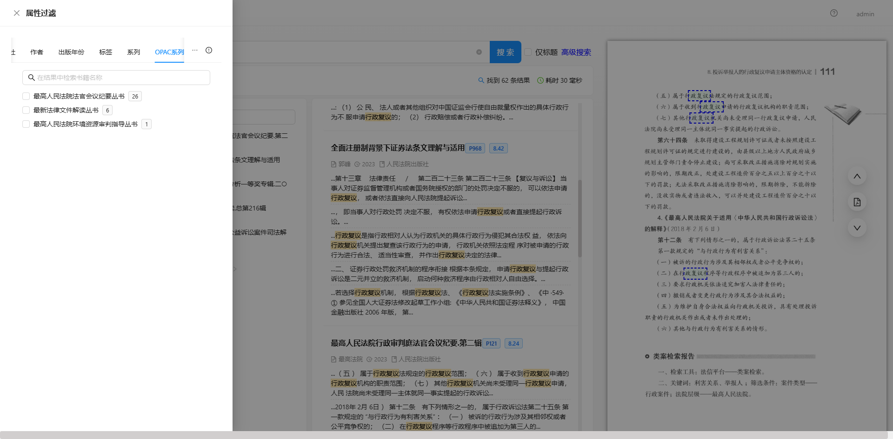
> 多条件过滤

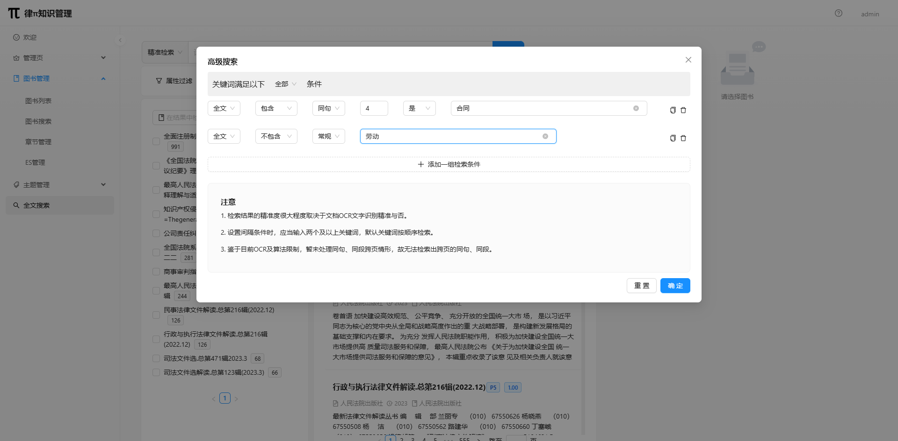
> 支持高级检索：支持多字段多条件检索，支持同段、同句检索

10. AI助手
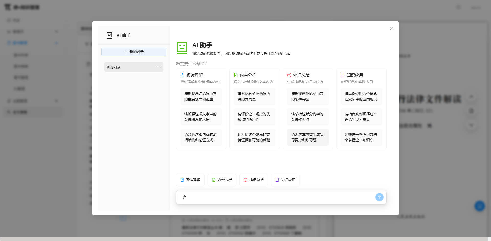
> 接入AI大模型，暂支持DeepSeek大模型


## 技术栈

### 后端技术栈
- Spring Boot 3.2.1
- MySQL 8.0

- Elasticsearch 8.12.2
- Redis 7.2
- MinIO
- Sa-Token 认证
- MyBatis-Plus
- PDFBox

### 前端技术栈
- React 18
- Ant Design
- UmiJS
- TypeScript

## 环境要求

### 硬件要求

#### 最小硬件配置建议
CPU：
- Elasticsearch: 至少 2 核心
- MySQL: 至少 1 核心
- 其他服务 (Redis, MinIO, Backend, Frontend): 共需 2 核心
- 总计最小需求：4-6 核心 CPU

内存 (RAM)：
- Elasticsearch: 至少 2GB（通过 ES_JAVA_OPTS 配置）
- MySQL: 至少 1GB
- Redis: 512MB
- MinIO: 512MB
- Backend (Java 应用): 1GB
- Frontend + Nginx: 512MB
- 总计最小需求：6GB RAM

存储空间：
- Elasticsearch 数据: 至少 10GB
- MySQL 数据: 至少 5GB
- Redis 数据: 1GB
- MinIO 对象存储: 10GB（取决于文件存储需求）
- 应用日志和其他: 2GB
- 总计最小需求：30GB 存储空间

网络：
- 建议至少 100Mbps 带宽
- 所有服务都在同一个 bridge 网络中

#### 推荐配置
为了获得更好的性能和稳定性，建议：
- CPU: 8 核心
- 内存: 16GB RAM
- 存储: 100GB SSD
- 网络: 1Gbps

#### 注意事项
- Elasticsearch 是最消耗资源的服务，特别是内存使用
- 如果有大量并发用户，应该相应增加内存和 CPU
- 如果需要存储大量文件，需要相应增加 MinIO 的存储空间
- 建议使用 SSD 存储以提高性能，特别是对 Elasticsearch 和 MySQL
- 需要根据实际使用场景（并发用户数、数据量、文件存储需求等）来调整这些配置。

### 软件要求
- Docker 20.10.x 及以上（推荐部署方式）
- Docker Compose 2.x 及以上
- Git

### 开发环境要求
- JDK 17+
- Node.js 18+
- Maven 3.8+
- MySQL 8.0
- Redis 7.2
- Elasticsearch 8.12.2
- MinIO

## 部署指南

### Docker部署（推荐）

#### 1. 克隆项目
```bash
git clone https://github.com/your-repo/BookMS.git
cd BookMS
```

#### 2. 环境配置
1. 复制环境变量模板：
```bash
cp .env.example .env
```

2. 修改`.env`文件，配置必要的环境变量：
```properties
# MySQL配置
MYSQL_ROOT_PASSWORD=your_password
MYSQL_DATABASE=LPMS
MYSQL_PORT=3306

# Redis配置
REDIS_PASSWORD=your_redis_password
REDIS_PORT=6379

# Elasticsearch配置
ELASTICSEARCH_PORT=9200
ELASTIC_USERNAME=elastic
ELASTIC_PASSWORD=your_es_password
ES_JAVA_OPTS="-Xms1g -Xmx1g"

# MinIO配置
MINIO_ROOT_USER=your_minio_user
MINIO_ROOT_PASSWORD=your_minio_password
MINIO_API_PORT=9000
MINIO_CONSOLE_PORT=9001

# 后端配置
BACKEND_PORT=9090
SPRING_PROFILES_ACTIVE=prod
JAVA_OPTS=-Xms1024m -Xmx1024m

# Nginx配置
NGINX_PORT=80
NGINX_SSL_PORT=443

# AI配置（可选）
DEEPSEEK_API_KEY=your_api_key
```

> 注意：请根据自身数据量调整ES、Java的内存配置。

#### 3. 启动服务
```bash
# 启动所有服务
docker-compose up -d

# 查看服务状态
docker-compose ps

# 查看服务日志
docker-compose logs -f
```

#### 4. 访问服务
- 主控台: http://localhost:80
- 后端API: http://localhost:9090
- MinIO控制台: http://localhost:9001
- Elasticsearch: http://localhost:9200

### 手动部署

#### 1. 后端部署

1. 配置Java环境
```bash
# 确保安装JDK 17+
java -version
```

2. 配置application.yml

3. 编译打包
```bash
cd bookMS
mvn clean package -DskipTests
```

4. 运行后端服务
```bash
java -jar target/bookms.jar
```

#### 2. 前端部署

1. 安装依赖
```bash
cd bookApp
npm install 
或 yarn install
```

2. 配置环境变量
```bash
cp .env.example .env.production
```

编辑`.env.production`：
```properties
VITE_API_URL=http://localhost:9090
VITE_ES_URL=http://localhost:9200
VITE_ES_USERNAME=elastic
VITE_ES_PASSWORD=your_es_password
```

3. 构建前端
```bash
npm run build
```

4. 配置Nginx
> 因本项目为前后端分离项目，注意配置相关代理，否则无法访问后端API；可参考默认配置；

## 开发指南

### 后端开发
1. 在IDE中导入bookMS项目
2. 配置application.yml中的数据库等连接信息
3. 运行LvPiApplication主类

### 前端开发
1. 进入bookApp目录
2. 安装依赖:
```bash
yarn install
```
3. 启动开发服务器:
```bash
yarn dev
```
4. 访问 http://localhost:8000

## 项目结构

```
.
├── bookMS/                  # 后端项目
│   ├── src/
│   │   ├── main/
│   │   │   ├── java/com/bookms/
│   │   │   │   ├── controller/       # REST API 控制器
│   │   │   │   ├── service/          # 业务逻辑层
│   │   │   │   ├── repository/       # 数据访问层（MyBatis-Plus）
│   │   │   │   ├── model/            # 数据实体类
│   │   │   │   ├── config/           # 配置类（Sa-Token/Security/Redis等）
│   │   │   │   ├── utils/            # 工具类
│   │   │   │   └── Application.java  # 启动类
│   │   │   └── resources/
│   │   │       ├── application.yml   # 主配置文件
│   │   │       ├── bootstrap.yml     # 环境配置
│   │   │       └── mapper/           # MyBatis XML映射文件
│   │   │
│   │   └── Dockerfile            # 后端Dockerfile
│   └── pom.xml               # Maven依赖配置
│
├── bookApp/                 # 前端项目
│   ├── src/
│   │   ├── pages/           # 页面组件
│   │   ├── components/      # 通用UI组件
│   │   ├── services/        # API请求服务
│   │   ├── models/          # 数据模型
│   │   ├── layouts/         # 全局布局
│   │   ├── config/          # UmiJS配置
│   │   ├── public/          # 静态资源
│   │   └── global.less      # 全局样式
│   ├── Dockerfile           # 前端Dockerfile
│   ├── package.json         # 依赖配置
│
├── docker/                  # Docker相关配置
│   ├── config/              # 配置文件
│   │   ├── backend/         # 后端配置文件
│   │   ├── frontend/        # 前端配置文件
│   │   └── elasticsearch/   # ES配置文件
│   ├── nginx/               # Nginx配置
│   │   └── nginx.conf
│   └── filedata/            # 文件数据
└── docker-compose.yml       

```

## 关于导入图书

请务必按顺序操作：导入/添加图书信息 --> 获取OPAC数据（如不希望获取可以跳过） --> 添加标签分类（如不希望添加可以跳过） --> 抽取内容并建立索引 --> 全文检索；


> 注意：
> - 添加标签需在建立索引之前，否则全文检索时无法按标签过滤数据；
> - 抽取内容并建立索引，需要等待一段时间，具体取决于图书数量和系统配置，请耐心等待。
> - 批量导入图书信息时，请按`book_import_template.xlsx`模板格式导入，否则会导致导入失败;其中书名与isbn 为必填项，其他项为选填项；图书路径应当是（挂载）**filedata目录下的相对路径**，如：`book.pdf`、`/文件夹2/book2.pdf`、`/文件夹3/book3.pdf`；
> - 如希望能够进行全文检索，导入PDF图书前请先OCR!先OCR!先OCR!本项目未接入OCR功能；


## 标签设计

`lp_topic`表是基于图书的分类，每个标签代表一个图书的分类，标签可以有多个，每个标签可以有多个图书。

1. 【带层级关系的主题分类】    
  这类标签具有父子关系，使用 parent_id 存储父标签。  
  • 约定：level 数值采用自然树中所处的深度（如0、1、2、3……）  
  • 要求：由于一般层级不会太深，约定由 0 到 99 表示树状结构的层级关系。  
2. 【不带层级的通用自定义标签】    
  这类标签没有父子关系，且应用单一业务场景。  
  • 约定：将 level 固定为 100  
  • parent_id 必须为 NULL，表示没有层级结构。  
3. 【不带层级的书籍类型】  
  比如民法、刑法等，这里认为这类标签无需层级结构。  
  • 约定：将 level 固定为 101  
  • parent_id 固定为 NULL。  
4. 【不带层级的实务专题】  
  例如劳动专题、执行专题等，同样不具有层级关系。  
  • 约定：将 level 固定为 102  
  • parent_id 固定为 NULL。
 
5. 【不带层级的其他分类】   
   根据业务需求，可以自定义标签，但是不具有层级关系。  
   • 约定：将 level 固定为 103...  
   • parent_id 固定为 NULL。  

## 软件使用声明

1. 本系统仅供个人学习、研究及合法知识管理用途
2. 禁止用于以下非法用途：
   - 传播盗版电子书或受版权保护内容
   - 存储或传播违法、涉密信息
   - 任何违反当地法律法规的行为
3. 使用者需对自身行为负责，开发者不承担任何因非法使用导致的连带责任

## 开源许可与商用授权声明

本项目（律π）采用 **MIT 许可协议** 进行开源，允许所有开发者在符合 MIT 许可协议条款的前提下对源代码进行使用、复制、修改和分发（包括个人和非商业用途）。但对于商业用途（包括但不限于盈利性软件、商业服务等），必须经过作者的单独授权后方可使用。

更多详细信息请参见 [LICENSE](LICENSE) 文件（其中包含带有 Commons Clause 附加条款的详细说明）。
